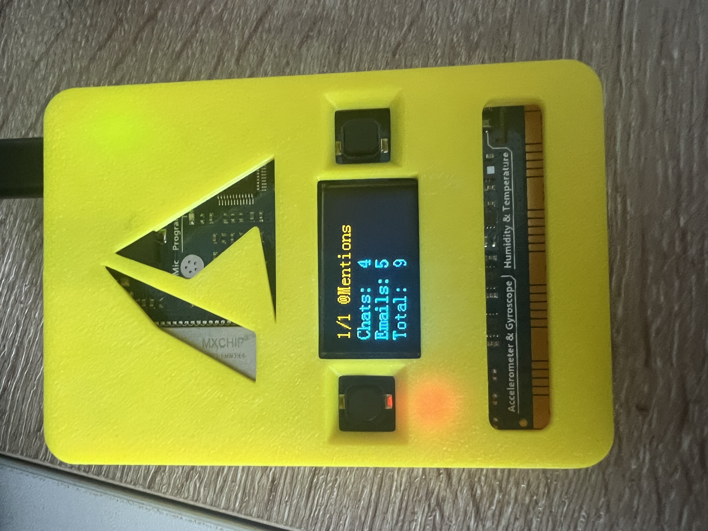

# DingDong

<p align="center"></p>

A small desk gadget built on the **MXChip AZ3166 IoT DevKit**, paired with a
Windows companion app (**ControlPlan**) that runs on your PC. The device
shows one "utility" at a time on its OLED — Pomodoro timer, comfort
(temperature/humidity), Wi-Fi survey, NTP clock, step counter, bubble
level, compass, noise meter, **@Mentions counter**, etc. — and you cycle
through the enabled utilities with the two on-board buttons.

The PC app decides *which* utilities are active and feeds the device any
data the device can't gather on its own (currently: unread Outlook
@-mentions and Teams chat activity).

---

## How the system works (high level)

```
+-----------------------------+                       +------------------------------+
|        Windows PC           |                       |   MXChip AZ3166 (firmware)   |
|                             |                       |                              |
|  +-----------------------+  |   HTTP, JSON, LAN     |  +------------------------+  |
|  |   ControlPlan         |  | <-------------------- |  | once per ~60s:         |  |
|  |   (WinForms .NET 8)   |  |   GET /config         |  |   WiFi.begin()         |  |
|  |                       |  |   X-DingDong-Token    |  |   HTTP GET /config     |  |
|  |  - HttpHost           |  | --------------------> |  |   parse JSON           |  |
|  |    (port 18088,       |  |   200 OK { enabled,   |  |   update enabled list  |  |
|  |     token + IP ACL)   |  |     chats, emails }   |  |   WiFi.disconnect()    |  |
|  |  - MentionsReader     |  |                       |  +------------------------+  |
|  |    (UserNotification- |  |                       |                              |
|  |     Listener for      |  |                       |  +------------------------+  |
|  |     Outlook toasts)   |  |                       |  | every 50ms:            |  |
|  |  - TeamsBadgeReader   |  |                       |  |   poll buttons A/B     |  |
|  |    (UIA + OCR of      |  |                       |  |   tick current utility |  |
|  |     taskbar overlay)  |  |                       |  |   render to OLED       |  |
|  |  - AppSettings        |  |                       |  +------------------------+  |
|  |    (JSON in AppData)  |  |                       |                              |
|  +-----------------------+  |                       |                              |
+-----------------------------+                       +------------------------------+
```

### Lifecycle on the PC (ControlPlan)

1. **Startup.** Reads `appsettings.json` from
   `%LOCALAPPDATA%\DingDong\` (utility toggles, port, last counts).
2. **HTTP server.** `HttpHost` binds to `http://<ListenAddress>:18088/`
   (default port `18088`; address is configurable from the Security tab).
   If the URL ACL
   isn't granted it transparently falls back to `localhost`.
3. **Mention polling loop** (every ~10 s):
   - `MentionsReader` scans the Windows `UserNotificationListener`
     (Action Center) for Outlook toasts that look like @-mentions and
     counts them.
   - `TeamsBadgeReader` finds the Teams taskbar button via UI
     Automation, screenshots its red overlay badge, and OCRs the digit
     with Tesseract. That number becomes the "Chats" count.
   - The form updates its status line and persists the new counts.
4. **HTTP handlers** serve three endpoints:
   - `GET /config`   — `{enabled:[ids], chats, emails, trackChats, trackEmails}`
   - `GET /mentions` — just the counts (lighter payload for the device)
   - `GET /health`   — `"ok"` (liveness probe)

### Lifecycle on the device (firmware)

1. **Boot.** Initialises sensors (I2C, temp/humidity, pressure, mag,
   accel/gyro), shows the IP on the OLED.
2. **One-shot config sync.** `WiFi.begin()`, fetch `/config`, parse the
   JSON, populate `gEnabled[]`, then `WiFi.disconnect()` to stay clear
   of an AZ3166 BSP delayed-reset bug that triggers ~20 s after a Wi-Fi
   link goes up.
3. **Main loop** (~50 ms cadence):
   - Debounce buttons A (next) / B (previous) and switch the active
     utility.
   - Call the current utility's `onTick()` — it owns the OLED.
4. **Periodic resync** (every 60 s): briefly bring Wi-Fi up, re-fetch
   `/config`, disconnect again. The device stays idle/offline ~90 % of
   the time, which is what keeps the BSP stable.

### The utility catalogue

A utility is just a pair of function pointers (`onEnter`, `onTick`)
registered in `gUtilities[]` with a numeric ID. The ID list in
`Firmware/Firmware.ino` **must stay in sync** with `UtilityCatalog.Items`
in `ControlPlan/AppSettings.cs` — that's how the PC's checkboxes map to
the device's behaviour.

Some utilities (Clock, Steps, Level, Compass, Noise…) run fully offline
on the device. Others (currently just **@Mentions** = utility 21) read
extra fields from `/config` so the device just displays values the PC
computed.

---

## Repository layout

| Path           | Purpose                                                         |
| -------------- | --------------------------------------------------------------- |
| `Firmware/`    | Arduino sketch for the AZ3166 (`Firmware.ino`, `config.h`, `secrets.h`) |
| `ControlPlan/` | .NET 8 WinForms companion app (HTTP server + utility toggles + readers) |
| `README.md`    | This file                                                       |
| `.gitignore`   | Keeps `secrets.h`, build output and IDE noise out of git        |

---

## Setting up the firmware

1. Install the Arduino IDE and the **AZ3166 board package** (Microsoft
   IoT DevKit). See the [device's docs](https://microsoft.github.io/azure-iot-developer-kit/)
   if it's your first time.
2. Copy `Firmware/secrets.h.example` to `Firmware/secrets.h` and fill in:
   - Your Wi-Fi SSID and password.
   - The IP / port of the PC that will run ControlPlan (the app prints
     the candidate URLs in its UI on startup).
   - `secrets.h` is listed in `.gitignore` so your credentials never get
     committed. The macros it defines override the placeholder defaults
     in `config.h` at **compile time** — they're baked into the binary,
     not read from disk at runtime.
3. Open `Firmware/Firmware.ino` in the Arduino IDE, select the AZ3166
   board, and upload.

The device prints its current IP on the OLED while booting; if it shows
"WiFi FAIL / Check secrets.h" the credentials are wrong.

---

## Running ControlPlan

```powershell
cd ControlPlan
dotnet run
```

The first time the app needs OCR it lazy-downloads `eng.traineddata`
(~4 MB) to `%LOCALAPPDATA%\DingDong\tessdata\`. Settings are persisted to
`%LOCALAPPDATA%\DingDong\appsettings.json`.

---

## Security notes

ControlPlan ships with three layers of defense, all enabled by default and
managed from the **Security** tab in the app:

1. **Bound interface.** `HttpHost` binds to a single configured address
   (`AppSettings.ListenAddress`, default `+` = any interface). On first
   launch Windows will refuse the non-loopback bind with *Access is
   denied* and the server falls back to `localhost`. Click the
   **Reserve URL (admin)…** button on the Security tab once (UAC will
   prompt) and `HttpHost` will then bind to the chosen LAN IP. Equivalent
   manual command:
   ```powershell
   netsh http add urlacl url=http://192.168.1.241:18088/ user=Everyone
   ```
   (Use whatever address/port you picked in the dropdown.)
2. **Shared-secret token.** The PC generates a 24-byte URL-safe base64
   token on first launch and stores it in `appsettings.json`. The
   firmware sends it in the `X-DingDong-Token` header on every request;
   missing or wrong token = HTTP 401. The comparison is constant-time
   (`CryptographicOperations.FixedTimeEquals`). Copy the token from the
   Security tab into `Firmware/secrets.h` as `DINGDONG_AUTH_TOKEN` and
   re-flash. `/health` is the only endpoint exempt from the token check.
3. **Device-IP allowlist.** The Security tab shows a live
   `CheckedListBox` populated from two sources:
   - any IP that has recently hit the server (auto-discovery via the
     `OnSeenClientsChanged` event), annotated with *last seen Xs ago,
     N req, OK / REJECTED*;
   - any IP you've previously added or ticked (kept across restarts).

   Tick the device's IP and the allowlist takes effect on the **next**
   request — ticks are auto-persisted to `appsettings.json` immediately,
   no Save/Restart needed. Untick everything to disable the allowlist
   (in which case any IP with the correct token is accepted). Loopback
   is always allowed for diagnostics. A bold red banner reminds you to
   only tick IPs you trust.

### Port / firewall gotchas (Windows)

A few things bit me during setup; check these first if the device can't
reach the server:

- **Port exclusion ranges.** Windows reserves blocks of TCP ports for
  Hyper-V / WSL / Docker, and `HttpListener` will silently fail to bind
  inside them. List them with:
  ```powershell
  netsh int ipv4 show excludedportrange protocol=tcp
  ```
  The default config uses **port 18088** which is outside the typical
  exclusion range. Avoid 5000-5050 / 50000-50059 unless you've checked.
- **Firewall rule must be port-based, not program-based.** The listener
  runs in `HTTP.SYS` (PID 4 / kernel), not inside `ControlPlan.exe`, so
  a *program* firewall rule pointing at the exe does nothing. Add an
  inbound rule for **TCP 18088** (or whatever port you chose):
  ```powershell
  New-NetFirewallRule -DisplayName 'DingDong ControlPlan Port 18088' `
      -Direction Inbound -Action Allow -Protocol TCP -LocalPort 18088 -Profile Any
  ```
- **Network profile.** Set your Wi-Fi to **Private** — the firewall is
  much stricter on Public and will block LAN clients even with a rule:
  ```powershell
  Get-NetConnectionProfile                            # find InterfaceAlias
  Set-NetConnectionProfile -InterfaceAlias "WiFi" -NetworkCategory Private
  ```
- **Single-instance.** `ControlPlan.exe` enforces single-instance via a
  named mutex (`Local\DingDong.ControlPlan.SingleInstance`); a second
  launch shows an "already running" dialog and exits.

### Resilience

- If the device boots and `/config` is unreachable (no Wi-Fi, server
  down, 401, 403, timeout) it falls back to a curated 9-gadget menu
  (Pomodoro, Comfort, WiFi survey, Clock, Steps, Level, Compass, Noise,
  Mentions) so the UI is still usable.
- The device retries `/config` every **60 s** (`kConfigSyncIntervalMs`)
  with an 8 s Wi-Fi association timeout. A successful fetch overrides
  the fallback list with the user's selection from ControlPlan.

### Other things to know

- The transport is still **plain HTTP** — the token / IP / firewall
  checks stop unauthorised access on the LAN, but anyone sniffing your
  Wi-Fi can still see unread counts in the response body. If that
  matters, you'd need TLS with a pinned cert on the device (significant
  firmware work; see the notes in chat history).
- Wi-Fi credentials and the auth token live in `Firmware/secrets.h`
  (gitignored). Never paste them in `Firmware.ino` or anywhere
  committed. Placeholder URLs use the RFC 5737 documentation range
  (`192.0.2.x`) which is guaranteed unroutable.
- The companion app reads Windows toast notifications via
  `UserNotificationListener` — that requires the user to grant
  *Settings → Privacy & security → Notifications → Let apps access your
  notifications*. No external services are contacted.
- The OCR pipeline (`Tesseract`) executes locally; nothing leaves the
  machine. The one outbound network call is the first-run download of
  `eng.traineddata` from the upstream `tessdata_fast` GitHub repo.

---

## Building / packaging for release

```powershell
cd ControlPlan
dotnet publish -c Release -r win-x64 --self-contained
```

The single-folder output under
`bin/Release/net8.0-windows10.0.19041.0/win-x64/publish/` is what you
ship.

---

## License

Released under the [MIT License](LICENSE). Copyright (c) 2026 mrmubi.
